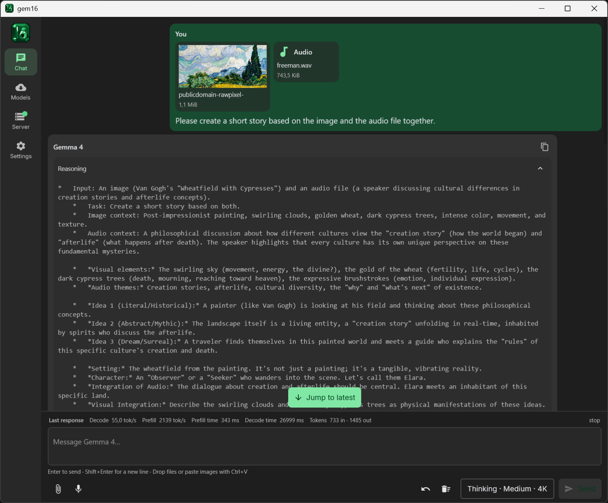

<p align="center">
  
</p>

<h1 align="center">gem16</h1>

<p align="center">
  Run Gemma 4 12B locally on a single 16 GB NVIDIA GPU.<br>
  Desktop app, OpenAI-compatible server, and a purpose-built CUDA inference engine.
</p>

<p align="center">
  <a href="https://github.com/Danmoreng/gem16/actions/workflows/ci.yml"></a>
  <a href="LICENSE"></a>
  
</p>

<p align="center">
  
</p>

gem16 is a local inference stack built specifically for Gemma 4 12B on Blackwell GPUs with about 16 GB of VRAM.
The desktop app is the primary entry point: it downloads the pinned model set into the shared Hugging Face cache,
starts or attaches to `gem16-server`, and provides a compact multimodal chat UI.

The engine loads the original mixed FP8/NVFP4 Safetensors checkpoint directly.

> [!IMPORTANT]
> gem16 is a development preview, not a release-qualified general-purpose runtime. The optimized CUDA backend
> currently targets Blackwell SM120/SM120a, and the supported model revisions are pinned deliberately.

## Experimental project

gem16 is developed primarily with AI coding agents. It explores model-specific execution plans and
Blackwell-optimized CUDA kernels for Gemma 4 12B within 16 GB of VRAM.

## Current 16K performance

### Linux

On an RTX 5080 Laptop GPU at its firmware-managed 175 W ceiling, gem16 commit `8e86cb38`, vLLM 0.26.0, and
llama.cpp b10240 produce the following same-machine result:

| Engine | Checkpoint / KV | Prefill tok/s | TTFT | Effective D2 MTP tok/s | ITL | Sampled peak VRAM |
|---|---|---:|---:|---:|---:|---:|
| vLLM 0.26.0 | direct FP8/NVFP4 / FP8 | **6,247.55** | **2,622.47 ms** | 81.95 | 12.202 ms | 15,465 MiB |
| **gem16** | direct FP8/NVFP4 / FP8 | 5,863.59 | 2,794.19 ms | **89.58** | **11.163 ms** | 11,867 MiB |
| llama.cpp b10240 | patched NVFP4+Q8_0 GGUF / Q8_0 | 3,922.61 | 4,176.81 ms | 82.88 | 12.065 ms | 10,631 MiB |

### Windows

On Windows 11 x64, the same RTX 5080 Laptop GPU running gem16 commit `1ffabc4` and llama.cpp b10240 in Lenovo Max
Power mode with CUDA 13.3 and driver 596.49 produces the following adjacent same-machine result:

| Engine | Checkpoint / KV | Prefill tok/s | TTFT | Effective D2 MTP tok/s | ITL | Sampled peak VRAM |
|---|---|---:|---:|---:|---:|---:|
| **gem16** | direct FP8/NVFP4 / FP8 | **6,047.04** | **2,709.43 ms** | **90.95** | **10.995 ms** | 11,820 MiB |
| llama.cpp b10240 | patched NVFP4+Q8_0 GGUF / Q8_0 | 3,940.28 | 4,158.08 ms | 86.77 | 11.524 ms | **10,586 MiB** |

All rows use batch one, the same 16,384-token Wikipedia prompt, 1,135 fixed output positions, fixed D2 MTP, three
warm-ups, and ten measurements. The Windows engines ran serially from 50 C and both reached approximately 175 W;
all measured outputs were deterministic. vLLM is omitted on Windows because its pinned runtime is unsupported there.

On Windows, gem16 leads llama.cpp by **53.47% in prefill** and **4.81% in decode**, with 34.84% lower TTFT and
4.59% lower ITL. On Linux, gem16 decode leads vLLM by **9.31%** and llama.cpp by **8.08%**, while prefill remains
6.15% behind vLLM. These are controlled performance comparisons, not exact format or semantic parity; checkpoint
formats, KV precision, output hashes, and prefill timing boundaries differ.

Reproduce the Linux comparison after preparing the pinned competitor environments:

```bash
sudo systemctl enable --now nvidia-powerd.service
echo max-power | sudo tee /sys/firmware/acpi/platform_profile
systemd-run --user --scope -p MemoryMax=48G -p MemorySwapMax=0 \
  ./scripts/benchmark-cross-engine-mtp.sh
```

See the [full methodology](benchmarks/baselines/cross_engine_mtp/README.md),
[Linux data](benchmarks/baselines/cross_engine_mtp/characterization.json), and
[Windows data](benchmarks/baselines/cross_engine_mtp/windows-characterization.json).

## Architecture

[](https://raw.githubusercontent.com/Danmoreng/gem16/main/docs/gem16-architecture.svg)

The diagram covers checkpoint loading, runtime ownership, GPU execution, memory, decode, and transactional MTP.
It is exported from the [editable tldraw source](docs/gem16-overview.tldraw).

## What works today

### Desktop app

- Download and verify the target model, the official MTP draft assistant, and Google's tokenizer configuration.
- Reuse the standard Hugging Face Hub cache through `HF_HUB_CACHE`, `HF_HOME`, or `XDG_CACHE_HOME`.
- Start, stop, restart, inspect, or attach to a local `gem16-server` process.
- Stream Markdown answers with separate, collapsed-by-default reasoning.
- Copy complete answers or individual fenced code and HTML blocks with one click.
- Send text, text-based PDFs, UTF-8/UTF-16 text documents, PNG/JPEG/BMP images, and WAV/FLAC/MP3 audio.
- Attach files with the file picker or drag and drop; use microphone recording or image paste with `Ctrl+V`/`Cmd+V`.
- See live prefill, decode, token, and throughput statistics while a response is streaming.
- See exact used/available context tokens after each response.
- Configure the system prompt, local date/time tools, context, sampling, MTP draft budget, reasoning budget, and appearance.

### Runtime

| Area | Current implementation |
|---|---|
| Model | Pinned Gemma 4 12B Unified mixed FP8/NVFP4 checkpoint |
| Platforms | Windows x64 and Linux x86-64; optimized CUDA path for SM120/SM120a |
| Execution | Batch-one prefill and decode with resident weights and conversation KV state |
| Precision | FP8 attention, packed NVFP4 MLPs, BF16 embeddings, FP8 or BF16 KV cache |
| Decode | Whole-model CUDA Graph replay and native T=1 projection plans |
| MTP | Optional pinned assistant with D1/D2/D4 verification and GPU acceptance/commit |
| Inputs | Text, images, and audio; video is not implemented |
| Interfaces | Desktop app, interactive CLI, and OpenAI-compatible HTTP/SSE server |
| Validation | Host/CUDA tests plus operator, layer, logit, generation, and long-context checks |

Unsupported precision paths fail visibly. A missing native NVFP4 kernel is never hidden behind a silent
higher-precision fallback.

## Run the desktop app from source

### Prerequisites

- A Blackwell NVIDIA GPU with approximately 16 GB of VRAM for the optimized inference path
- The pinned CUDA toolkit and CUTLASS submodule
- CMake 3.28 or newer, Ninja, and a C++20 compiler
- JDK 21 for the Compose Desktop application
- A Hugging Face account with access to the gated Google Gemma repositories

The exact reference environment is recorded in
[`toolchains/blackwell16gb.lock`](toolchains/blackwell16gb.lock).

Clone the repository and initialize its pinned dependencies:

```bash
git clone --recurse-submodules https://github.com/Danmoreng/gem16.git
cd gem16
```

### Windows

From PowerShell:

```powershell
.\scripts\build.ps1 -Cuda -Test
.\scripts\run-studio.ps1
```

The development launcher incrementally rebuilds and uses the workspace CUDA
server. Pass `-SkipServerBuild` only when that native binary is already current;
persisted settings pointing at an installed server do not override development
launches.

### Linux

```bash
./scripts/build.sh --cuda --test
./scripts/run-studio.sh
```

The Linux launcher provides the equivalent `--skip-server-build` opt-out.

On first launch, open **Models**, provide a Hugging Face token if necessary, and download the pinned model set.
Files are stored in the shared content-addressed Hugging Face cache and are not copied into the application.
After verification, the managed server can start and the Chat screen is ready to use.

To build a native installer for the current platform after the release server exists:

```powershell
# Windows
.\scripts\package-studio.ps1
```

The Windows script writes the MSI to `studioApp/build/compose/binaries/main/msi/`. The installer includes the
CUDA-enabled server; checkpoints remain in the shared Hugging Face cache.

```bash
# Linux
./scripts/package-studio.sh
```

See [`docs/STUDIO.md`](docs/STUDIO.md) for application packaging, cache behavior, protocol details, and security
notes.

## Download models without the app

The same locked model set can be populated from Python:

```bash
python tools/fetch_model.py
python tools/fetch_model.py --lock models/gemma4-12b-mtp-assistant.lock.json
```

The downloader verifies exact revisions, file sizes, and SHA-256 checksums. Benchmark, validation, and test tools
resolve these cache snapshots automatically; `--model` remains available as an explicit override.

## Server and CLI

`gem16-server` exposes `/health`, `/metrics`, `/v1/models`, `/v1/chat/completions`, and `/v1/responses`. It supports
streaming SSE, reasoning deltas, cancellation, structured tools, resident sessions, and ordered multimodal content.

```powershell
$model = python -c "from tools.hf_cache import default_target_model; print(default_target_model())"
$assistant = python -c "from tools.hf_cache import default_assistant_model; print(default_assistant_model())"

.\build\Windows\blackwell-release\bin\gem16-server.exe `
  --model $model `
  --assistant-model $assistant `
  --mtp-draft-tokens 2 `
  --model-name gem16 `
  --host 127.0.0.1 `
  --port 8080 `
  --max-context 32768
```

For terminal chat, replace `gem16-server.exe` with `gem16-chat.exe`. The CLI supports resident multi-turn chat,
reasoning budgets, sampling, images, audio, local function-tool schemas, MTP, and per-turn statistics. Full request
examples live in [`docs/SERVER.md`](docs/SERVER.md), [`docs/VISION.md`](docs/VISION.md), and
[`docs/AUDIO.md`](docs/AUDIO.md).

| Binary | Purpose |
|---|---|
| `gem16-server` | OpenAI-compatible local Chat Completions and Responses server |
| `gem16-chat` | Interactive or one-shot terminal chat |
| `gem16-run` | Inference, MTP, teacher forcing, state dumps, and capability reporting |
| `gem16-inspect` | Checkpoint validation and tensor/quantization inventory |
| `gem16-bench` | Model-load, memory, kernel, prefill, decode, and end-to-end benchmarks |

## Why a specialized engine?

gem16 follows the actual Gemma 4 architecture and checkpoint metadata instead of routing the model through a
generic graph framework:

- FP8 attention projections and packed NVFP4 MLP tensors are consumed according to the checkpoint schema.
- Safetensors are memory-mapped, validated, and streamed into final GPU allocations without a converted checkpoint.
- Gemma's local/global attention pattern, proportional RoPE, K=V semantics, logit softcap, and chat template are
  implemented explicitly.
- The token loop reuses resident weights, KV state, activation arenas, and captured CUDA Graphs without model-memory
  allocation.
- Reference paths remain beside optimized kernels so performance changes can be checked against numerical evidence.

Architecture and memory details are documented in [`docs/ARCHITECTURE.md`](docs/ARCHITECTURE.md),
[`docs/CHECKPOINT_FORMAT.md`](docs/CHECKPOINT_FORMAT.md), and [`docs/MEMORY.md`](docs/MEMORY.md).

## Performance and correctness

gem16 reports prefill, ordinary decode, MTP, memory, and end-to-end measurements separately. The comparison above
uses controlled same-machine Linux and Windows profiles; it does not replace ordinary-decode, task-quality, or
long-context gates. Cross-runtime format, cache, output, timing-boundary, and fallback differences remain visible.

Hardware, checkpoint, context, output count, sampling, quality, VRAM, clocks, power, and baseline tensor formats
must accompany any performance claim. Reproduction commands, raw-evidence policy, caveats, and historical results
live in [`benchmarks/baselines/cross_engine_mtp/`](benchmarks/baselines/cross_engine_mtp/),
[`docs/PERFORMANCE_LEDGER.md`](docs/PERFORMANCE_LEDGER.md), and
[`docs/BENCHMARKING.md`](docs/BENCHMARKING.md).

## Current limitations

- Only the pinned Gemma 4 12B Unified checkpoint family is supported.
- Inference is batch one; continuous batching is not implemented.
- The optimized CUDA backend requires Blackwell SM120/SM120a.
- Video input, response branching, and persistent prompt-cache files are not implemented.
- Numerical validation and wider task-quality qualification remain active work.

## Documentation

- [`docs/STUDIO.md`](docs/STUDIO.md) — desktop app, model downloads, and managed server
- [`docs/SERVER.md`](docs/SERVER.md) — HTTP APIs, streaming, sessions, tools, and media
- [`docs/ARCHITECTURE.md`](docs/ARCHITECTURE.md) — runtime and kernel architecture
- [`docs/CORRECTNESS.md`](docs/CORRECTNESS.md) — numerical validation and current gates
- [`docs/MTP.md`](docs/MTP.md) — assistant model and speculative decode design
- [`docs/DECODE_OPTIMIZATION_PLAN.md`](docs/DECODE_OPTIMIZATION_PLAN.md) — active ordinary-decode and MTP performance plan
- [`docs/BENCHMARKING.md`](docs/BENCHMARKING.md) — benchmark methodology
- [`docs/PERFORMANCE_LEDGER.md`](docs/PERFORMANCE_LEDGER.md) — retained measurements and profiling evidence
- [`docs/ROADMAP.md`](docs/ROADMAP.md) — remaining milestones

## License

gem16 is licensed under the [Apache License 2.0](LICENSE). The vendored CUTLASS dependency retains its BSD-3-Clause
license. Model weights and tokenizer assets are distributed separately under their respective terms.
