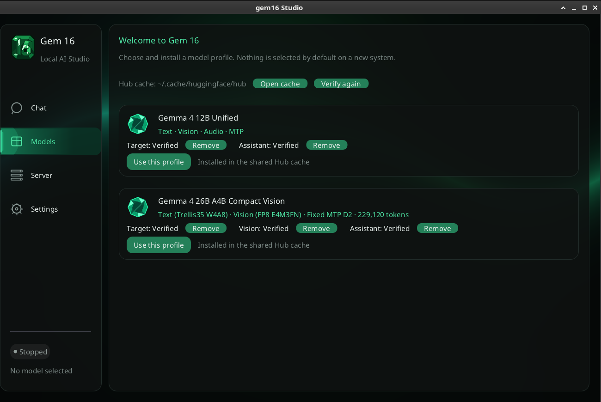

<p align="center">
  
</p>

<h1 align="center">gem16</h1>

<p align="center">
  Run Gemma 4 12B or 26B locally on a single 16 GB NVIDIA GPU.<br>
  Local agent server, purpose-built CUDA inference engine, and optional native desktop app.
</p>

<p align="center">
  <a href="https://github.com/Danmoreng/gem16/actions/workflows/ci.yml"></a>
  <a href="LICENSE"></a>
  
</p>


gem16 is a local inference stack built specifically for Gemma 4 on Blackwell GPUs with about 16 GB of VRAM. Gemma 4
12B Unified and Gemma 4 26B A4B Compact Vision are the two equal, user-selectable product profiles. The primary entry is `gem16-server` with a local coding agent; the optional native C++
desktop app starts or attaches to the server, manages profiles and provides streamed chat. The 12B profile supports text, image, and audio; Compact Vision combines its locked
Trellis35 W4A8 text Target with an FP8 E4M3FN Vision module and optional fixed-D2 Assistant.

The 12B profile loads its pinned mixed FP8/NVFP4 Safetensors checkpoint directly. Compact Vision consumes its
offline-compiled, immutable GEM16 components. The former public text-only 26B NVFP4 profile remains implemented and
qualified internally for regression and rollback, but is not shown as a normal Studio choice.

> [!IMPORTANT]
> gem16 is a development preview, not a release-qualified general-purpose runtime. The optimized CUDA backend
> currently targets Blackwell SM120/SM120a, and the supported model revisions are pinned deliberately.

## Product profiles

| Profile | Model size | Quantization / components | Download size | Capabilities |
|---|---:|---|---:|---|
| Gemma 4 12B Unified | 11.95B parameters | Mixed FP8/NVFP4 Target plus Assistant | about 10.2 GB | Text, image, audio, MTP |
| Gemma 4 26B A4B Compact Vision | 25.2B total / 3.8B active parameters | Trellis35 W4A8 Target, FP8 E4M3FN Vision, optional hybrid NVFP4/FP8/BF16 Assistant | 12.8 GB without / 13.1 GB with Assistant | Text, images within context capacity, optional fixed-D2 MTP |

The Compact Vision weight payloads occupy 13,060,400,408 bytes (12.16 GiB) with the Assistant. Its text Target is
12,204,692,480 bytes, Vision is 597,390,648 bytes, and the Assistant is 258,317,280 bytes.

## Server and API

Build the headless server with `./scripts/build.sh --cuda --test` on Linux or
`.\scripts\build.ps1 -Cuda -Test` on Windows, then follow the server guide.
Run the server independently or let Studio manage it. The [server guide](docs/SERVER.md)
contains locked downloads and launch commands for **both public profiles**.
Chat Completions and Responses support streamed text, reasoning and client-executed function tools.
Compatibility is the explicit [OpenAI Agent Core v1 subset](docs/OPENAI_AGENT_CORE_V1.md);
unsupported fields fail visibly. Networking defaults to local loopback.
Use the [tested SDK/Pi configuration](docs/AGENT_COMPATIBILITY.md) for agent setup.
Compact Vision everyday context: **220,000 Linux / 170,000 Windows tokens**,
subject to VRAM admission with 200 MiB long-context reserve.

```bash
curl http://127.0.0.1:8080/v1/chat/completions \
  -H 'Content-Type: application/json' \
  -d '{"model":"gem16","messages":[{"role":"user","content":"Hello!"}],"max_completion_tokens":128}'
```

`gem16-chat` provides terminal chat; `gem16-run`, `gem16-inspect` and `gem16-bench`
provide inference, checkpoint inspection and benchmarking tools.

## Run the optional desktop app from source

<p align="center">
  
</p>

### Prerequisites

- A Blackwell NVIDIA GPU with approximately 16 GB of VRAM for the optimized inference path
- The pinned CUDA toolkit and CUTLASS submodule
- CMake 3.28 or newer, Ninja, and a C++20 compiler
- `curl` on `PATH` for resumable downloads in the native Models screen (included with current Windows)
- OpenGL/X11 or Wayland development libraries on Linux; the Windows client uses Direct3D 11
- No account or token is required for the public repositories pinned by the current Studio catalog

The exact reference environment is recorded in
[`toolchains/blackwell16gb.lock`](toolchains/blackwell16gb.lock).

Clone the repository and initialize its pinned dependencies:

```bash
git clone --recurse-submodules https://github.com/Danmoreng/gem16.git
cd gem16
```

### Windows

From PowerShell:

```powershell
.\scripts\build.ps1 -Cuda -Test
.\scripts\run-studio.ps1
```

The development launcher incrementally rebuilds and uses the workspace CUDA
server. Pass `-SkipServerBuild` only when that native binary is already current;
persisted settings pointing at an installed server do not override development
launches.

### Linux

```bash
./scripts/build.sh --cuda --test
./scripts/run-studio.sh
```

The Linux launcher provides the equivalent `--skip-server-build` opt-out.

On first launch, Studio opens **Models** and presents 12B Unified and 26B Compact Vision without a preselected default. Install either profile
or both, then select a verified profile and verify the compiled path on **Server**. Studio reuses already populated Hub
blobs, resumes incomplete downloads, and never copies checkpoints into the application archive. The 12B Target spans
two existing upstream repositories, so Studio creates a hardlink-only runtime view inside the same Hub cache; it does
not publish a mirror or duplicate the payload bytes.


## Recorded performance

On the RTX 5080 Laptop GPU at its firmware-managed 175 W ceiling, the public
Compact Vision **text Target** recorded **130.906 tok/s ordinary decode** and
**182.526 tok/s fixed-D2 decode**, with 12,522 / 12,794 MiB peak VRAM.
These are retained Linux batch-one measurements with a 16,384-token prompt,
checkpoint-FP8 KV, three warmups and ten runs; Ordinary and D2 produced the same
1,229 output tokens. They are text measurements, not image throughput or a new HEAD benchmark.

[Performance results and reproduction](docs/PERFORMANCE.md) retain the complete 12B Linux/Windows
measurements, internal 26B NVFP4 results, competitor comparisons, revisions and semantic caveats.
The [benchmark contract](docs/BENCHMARKING.md) governs new claims.

## Current limits and release status

- Optimized inference targets Blackwell SM120/SM120a and batch one; no continuous batching.
- 12B supports text, image and audio. Compact Vision supports text and images within context capacity, one resident slot,
  and its optional fixed-D2 Assistant. The internal NVFP4 profile is text-only.
- Studio settings and non-temporary chats persist in SQLite; temporary chats are not retained.
- Full Windows/Linux API qualification, packaging parity and clean-machine onboarding remain release gates.
  Bounded Compact Vision P20 acceptance does not mean a release has shipped; extended QUAL01 was waived.
- Video, durable server-side conversations and Responses branching are outside the current product.

## Documentation and development

Start at the [documentation index](docs/README.md) for user guides, development contracts and historical evidence.
Current scope lives in the [product contract](docs/PRODUCT_CONTRACT.md),
[active decisions](docs/ACTIVE_DECISIONS.md) and [roadmap](docs/ROADMAP.md).
The [architecture](docs/ARCHITECTURE.md) explains the specialized C++20/CUDA engine and resident execution plans.
Development is primarily assisted by AI coding agents; changes remain subject to the repository's
correctness, provenance and measured-performance rules.

## License

gem16 is licensed under the [Apache License 2.0](LICENSE). Vendored dependencies retain their respective licenses.
Model weights and tokenizer assets are distributed separately under their respective terms.
